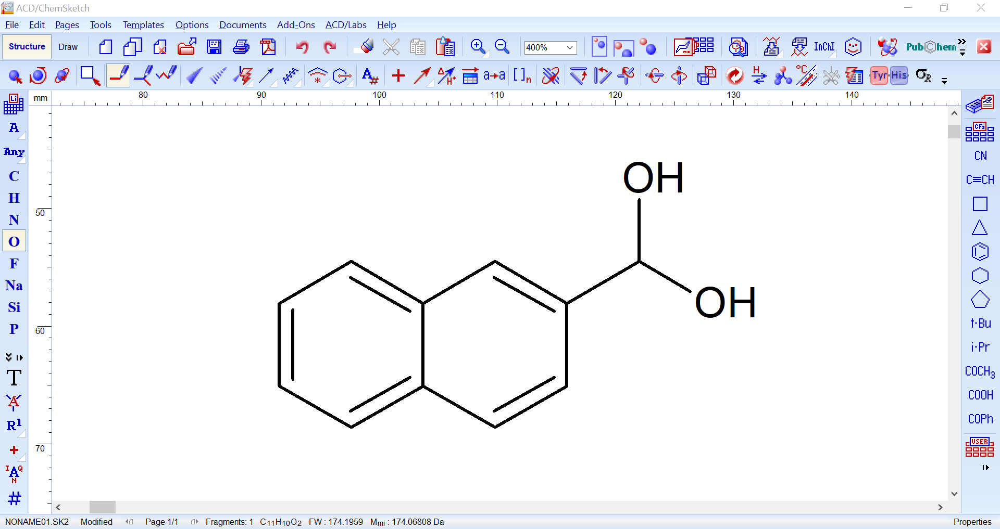

# HSQC Spectra Simulation and Matching Tool
 

Implementation of the following publication: 

**Advancing HSQC Spectral Matching: A Comparative Study of Peak-Matching and Simulation Techniques for Molecular Identification**

Link to the paper: [link](https://dummy.com) (dummy)

*The tool allows for identification of correct molecules among similar analogues (molecules with the very similar molecular weight or different regio- or stereoisomers)*

## What is this?

This tool provides a comprehensive platform for simulating and matching Heteronuclear Single Quantum Coherence (HSQC) spectra which can be used to facilitate molecular structure elucidation. 
The tool provides an implementation of a machine learning based 1H and 13C NMR prediction with a graph-based neural network (ML) which was published as follows:
**Scalable graph neural network for NMR chemical shift prediction**  [URL](https://pubs.rsc.org/en/Content/ArticleLanding/2022/CP/D2CP04542G)
from *Jongmin Han, Hyungu Kang, Seokho Kang, Youngchun Kwon, Dongseon Lee and Youn-Suk Choi* 

Furthermore, it incorporates four distinct HSQC simulation techniques: ACD-Labs (ACD), MestReNova (MNova), Gaussian NMR calculations (DFT), and a graph-based neural network (ML). For DFT and ML, we've supplemented the techniques with a self-implemented 2D HSQC reconstruction logic. We've also devised three peak-matching strategies—Minimum-Sum (MinSum), Euclidean-Distance (EucDist), and Hungarian-Distance (HungDist)—which are combined with three padding approaches—zero-padding (Zero), peak-truncated (Trunc), and nearest-neighbor double assignment (NN) which can be selected for peak matching. 

The tool is adept at handling molecules with very similar molecular weight or different regio- or stereoisomers, thereby facilitating the identification of correct molecules among similar analogues. Additionally, our methodology shows robust performance in resolving ambiguous structural assignments, as demonstrated on a set of previously misassigned molecules.
The tool is linked with a Google Colab notebook that allows users to apply our methodology to their own data, run the ML NMR prediction, and learn how to generate simulated spectra with commercial software. It also provides instructions on processing real spectra and conducting similarity comparisons using the algorithms we've implemented. This hands-on, interactive tool is designed to enhance user understanding and practical application of the methodologies used.

Try it out yourself using the following Google Colab Notebook:
  
https://colab.research.google.com/drive/1WawzugDDloQSxrToI6T66gm9cfXZqWAm?usp=sharing
## Want to see a short video demonstration and user tutorials?
| Tutorial: Colab Notebook |  Tutorial: ACD HSQC Simulation |  Tutorial: MNova HSQC Simulation |  Tutorial: Experimental Data Preparation |
|:-:|:-:|:-:|:-:|
|  |  |  |  |

